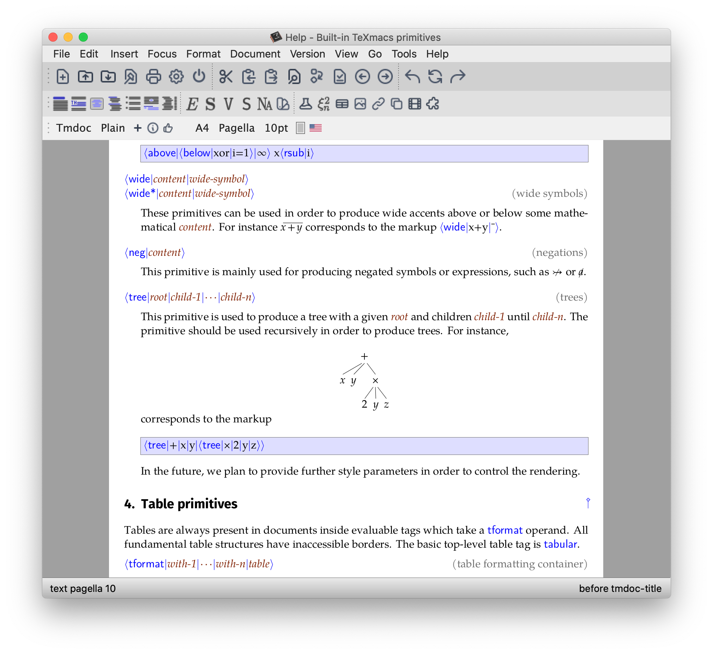

January 2023

Welcome! You are in the `wip_mupdf` branch of TeXmacs. This is experimental code. Build tools are not yet perfected for it. You can try to run
```
./configure --with-mupdf
``` 
and brace for it to find the needed libraries and set up things correclty. Patches to the build process are welcome.

The goal of this branch is to implement a new document rendering subsystem based on the [MuPDF](https://mupdf.com) PDF library. This will allow us to handle also images in PDF (and SVG) format and all the other formats supported by MuPDF and make our document rendering independent of the GUI library. Currently we rely on Qt for these tasks and we do not have any 
internal support for vector images. 





In a second step we will evaluate the possibility to reimplement the PDF *output* device, now based on the [Hummus PDF](https://pdfhummus.com) library with MuPDF (to minimize our footprint).


Some additional literature on MuPDF can be found here:
- T. Hoekwater paper on MuPDF for TUGboat (2019) ([PDF](https://tug.org/TUGboat/tb40-3/tb126hoekwater-mupdf.pdf))
- A presenation of Ghostscript, MuPDF and others Artifex's tools (2016) ([PDF](https://ftp.pwg.org/pub/pwg/liaison/openprinting/presentations/OpenPrint_GhostScript_April_2016.pdf))
- The MuPDF product leaflet ([PDF](https://artifex.com/documents/MuPDF-Product-Sheet.pdf))


<br>
<br>
<br>

(below follows the original `README.md`)

----

# GNU TeXmacs
[](https://gitter.im/texmacs/Lobby?utm_source=badge&utm_medium=badge&utm_campaign=pr-badge&utm_content=badge)

[GNU TeXmacs](https://texmacs.org) is a free wysiwyw (what you see is what you want) editing platform with special features for scientists. The software aims to provide a unified and user friendly framework for editing structured documents with different types of content (text, graphics, mathematics, interactive content, etc.). The rendering engine uses high-quality typesetting algorithms so as to produce professionally looking documents, which can either be printed out or presented from a laptop.

The software includes a text editor with support for mathematical formulas, a small technical picture editor and a tool for making presentations from a laptop. Moreover, TeXmacs can be used as an interface for many external systems for computer algebra, numerical analysis, statistics, etc. New presentation styles can be written by the user and new features can be added to the editor using the Scheme extension language. A native spreadsheet and tools for collaborative authoring are planned for later.

TeXmacs runs on all major Unix platforms and Windows. Documents can be saved in TeXmacs, Xml or Scheme format and printed as Postscript or Pdf files. Converters exist for TeX/LaTeX and Html/Mathml. 

## Documentation
GNU TeXmacs is self-documented. You may browse the manual in the `Help` menu or browse the online [one](https://www.texmacs.org/tmweb/manual/web-manual.en.html).

For developer, see [this](./COMPILE) to compile the project.

## Contributing
Please report any [new bugs](https://www.texmacs.org/tmweb/contact/bugs.en.html) and [suggestions](https://www.texmacs.org/tmweb/contact/wishes.en.html) to us. It is also possible to [subscribe](https://www.texmacs.org/tmweb/help/tmusers.en.html) to the <texmacs-users@texmacs.org> mailing list in order to get or give help from or to other TeXmacs users.

You may contribute patches for TeXmacs using the [patch manager](http://savannah.gnu.org/patch/?group=texmacs) on Savannah or using the [pull request](https://github.com/texmacs/texmacs/pulls) on Github. Since we are using SVN on Savannah, PRs won't be directly accepted on Github. We will `git apply` the patch into SVN repo if the PR is accepted. And we will close the PR and change the title to `[SVN] xxx` after applying the PR.
